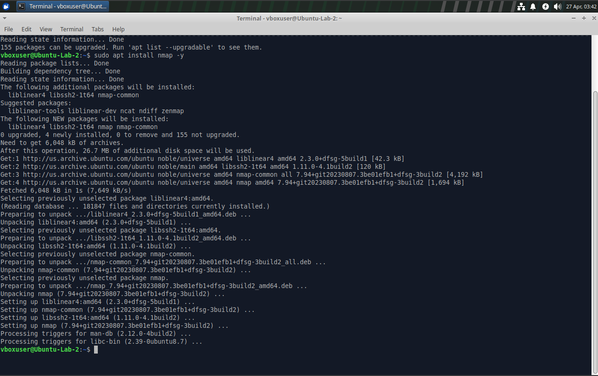
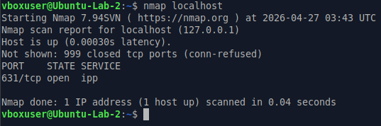
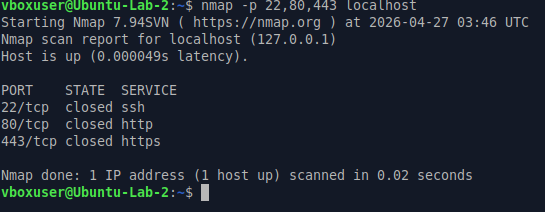
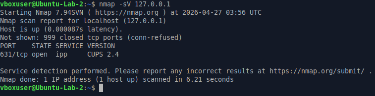

# Linux Port Scanning Lab

## Objective
Identify open ports and running services on a system using Nmap to understand potential attack surfaces and system exposure.

---

## Lab Overview
In this lab, I used Nmap to scan the local machine, identify open ports, check specific common ports, and perform service/version detection.

---

## Tools Used
- Ubuntu Virtual Machine
- Nmap
- Linux Terminal

---

## Steps Performed

### 1. Installed Nmap

    sudo apt update
    sudo apt install nmap -y

---

### 2. Scanned Localhost

    nmap localhost

---

### 3. Scanned Specific Ports

    nmap -p 22,80,443 localhost

---

### 4. Performed Service Detection

    nmap -sV 127.0.0.1

---

## Key Findings

- Port 631 was open and running the IPP printing service.
- Ports 22, 80, and 443 were closed.
- Service detection identified CUPS version 2.4.
- Open ports and service versions help identify potential attack surfaces.

---

## What I Learned

This lab helped me understand how to:

- Use Nmap to identify open ports
- Scan specific ports intentionally
- Detect running services and versions
- Think about system exposure from a cybersecurity perspective

---

## Role Connection

This lab connects to cybersecurity and GRC work because identifying open ports and running services helps support vulnerability management, asset visibility, risk assessment, and attack surface awareness.
